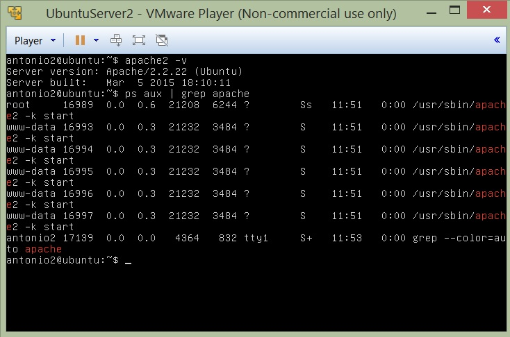
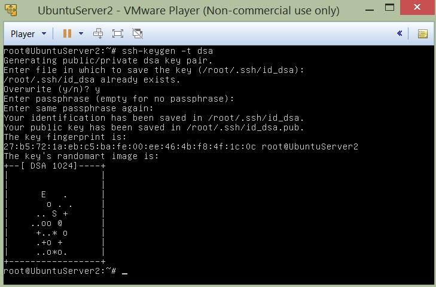
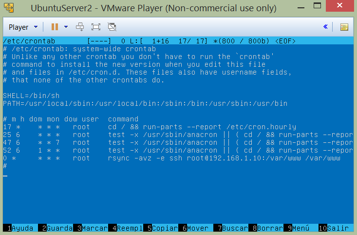

#Práctica 2

1. ###Crear un tar con ficheros locales en un equipo remoto
	**Lo haremos mediante la orden:**

	`$> tar czf - directorio | ssh equipodestino 'cat > ~/tar.tgz'`

	

2. ###Instalar la herramienta rsync
	**Seguiremos las siguientes ordenes:**
	
	**Instalando RSYNC** *(en este caso ya venia instalada).*

	`$> sudo apt-get install rsync`

	**Haciendo una prueba de sincronizacion mediante ssh de los directorios** *WWW.*

	`$> rsync -avz -e ssh root@maquina1:/var/www/ /var/www/`
	
	**Haciendo la sincronización entre los directorios sincronizando unicamente los cambios y evitando sincronizar los logs.**
	```
	rsync -avz --delete --exclude=**/stats --exclude=**/error --exclude=**/files/pictures -e ssh -l 
	root" root@maquina1:/var/www/ /var/www/
	```
	
	
	
	
	
	
